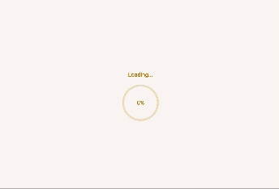

# My Portfolio

A modern, interactive portfolio website showcasing my work as a Flutter developer. Built with Flutter and Dart, featuring smooth animations, responsive design, and professional UI components.

## ✨ Features

### 🎨 Modern UI/UX
- **Professional Header Design** - Branded logo with gradient styling and animated theme toggle
- **Smooth Animations** - Page transitions, loading animations, and micro-interactions
- **Responsive Grid Layout** - Adaptive project display (2 columns on desktop, 1 on mobile)
- **Visual Hierarchy** - Consistent spacing and elegant section dividers

### 🔍 Interactive Elements
- **Real-time Project Search** - Instant filtering as you type
- **Category Filtering** - Filter projects by technology (Flutter, Mobile App, Web App, AI/ML, Firebase)
- **Hover Effects** - Interactive project cards with scale and shadow animations
- **Contact Form** - Functional form with validation and email integration

### 📱 Responsive Design
- **Cross-platform** - Works seamlessly on web, mobile, and desktop
- **Mobile-first** - Optimized touch interactions and responsive layouts
- **Adaptive Typography** - Font sizes adjust based on screen size
- **Flexible Components** - UI elements adapt to different viewport sizes

### 🌙 Theme Support
- **Dark/Light Mode** - Toggle between themes with smooth transitions
- **Consistent Styling** - Cohesive color scheme across all components
- **Google Fonts Integration** - Professional typography with Poppins and Inter fonts

### ⚡ Performance
- **Skeleton Loading** - Progressive loading with animated placeholders
- **Optimized Images** - Efficient image caching and aspect ratio handling
- **Smooth Scrolling** - Fluid navigation between sections

## 🚀 Demo

<p align="center">
  
</p>

## 🏗️ Project Structure

```text
lib/
├── main.dart                    # App entry point with theme configuration
├── provider/
│   └── theme.dart              # Theme state management
├── utils/
│   └── colors.dart             # Color constants and styling
├── views/
│   ├── splash.dart             # Animated splash screen
│   └── home/
│       ├── home.dart           # Main home screen with sections
│       ├── header_button.dart  # Professional header component
│       ├── footer.dart         # Footer section
│       ├── info/               # Profile and about section
│       ├── projects/           # Project showcase with search/filter
│       ├── certifications/     # Skills and certifications
│       └── contact_me/         # Interactive contact form
├── widgets/
│   └── skeleton_loader.dart    # Reusable loading components
└── assets/
    ├── icons/                  # App and technology icons
    ├── imgs/                   # Profile and general images
    ├── projects/               # Project screenshots
    └── certs/                  # Certification images
```

## 🛠️ Technologies Used

- **Framework**: Flutter 3.29.0
- **Language**: Dart
- **State Management**: Provider
- **Fonts**: Google Fonts (Poppins, Inter)
- **Responsive Design**: flutter_screenutil
- **Animations**: animated_text_kit + custom animations
- **External Links**: url_launcher

## 🎯 Key Components

### Interactive Project Cards
- Hover animations with scale and shadow effects
- Responsive image display with consistent aspect ratios
- Dynamic link buttons for App Store, Play Store, and GitHub
- Category-based filtering and real-time search

### Professional Contact Form
- Form validation with user feedback
- Email integration via mailto URLs
- Loading states and success animations
- Mobile-optimized input fields

### Responsive Grid System
- 2-column layout on desktop and tablet
- Single column with staggered animations on mobile
- Smooth transitions between layout changes

## 🚀 Getting Started

### Prerequisites
- Flutter 3.29.0 or higher
- Dart SDK
- Web browser (for web deployment)

### Installation

1. Clone the repository
```bash
git clone https://github.com/MHK-26/mhk_portfolio.git
cd mhk_portfolio
```

2. Install dependencies
```bash
flutter pub get
```

3. Run the application
```bash
# For web
flutter run -d chrome

# For mobile
flutter run
```

### Building for Production

```bash
# Web build
flutter build web

# Android build
flutter build apk

# iOS build
flutter build ios
```

## 📱 Screenshots

*Project showcases responsive design across different screen sizes with smooth animations and professional styling.*

## 🤝 Contributing

Feel free to submit issues and enhancement requests. Pull requests are welcome!

## 📄 License

This project is open source and available under the [MIT License](LICENSE).

## 👨‍💻 Developer

**Mohammad Hisham** - Flutter Developer
- GitHub: [@MHK-26](https://github.com/MHK-26)
- Portfolio: [Live Demo](https://mhk26.com)

---

*Built with ❤️ using Flutter*

